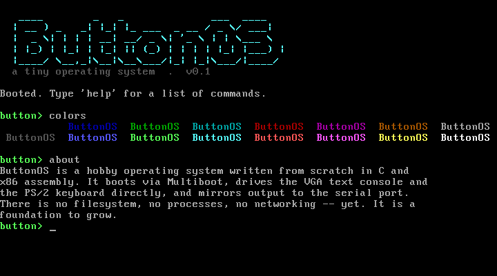

# ButtonOS

A tiny operating system, written from scratch in C and x86 assembly. It boots
on a bare machine (no Linux, no macOS underneath), draws to the screen, reads
the keyboard, and gives you a small interactive shell.

It is a *hobby* OS — a real foundation you can run and grow, not a replacement
for macOS. There is no filesystem, no multitasking, and no networking yet.
What there **is**:

- A Multiboot boot stub that a standard bootloader (or QEMU) can start.
- A VGA text-mode console with colour and scrolling.
- A polled PS/2 keyboard driver with shift handling and line editing.
- A shell with `help`, `about`, `clear`, `echo`, `colors`, and `reboot`.
- Every character mirrored to the serial port, so it can be run headlessly.



## What's in here

```
os/
├── Makefile          build + run targets
├── src/
│   ├── boot.asm      Multiboot header and 32-bit entry point
│   ├── linker.ld     memory layout (kernel loaded at 1 MiB)
│   └── kernel.c      the whole kernel: VGA, serial, keyboard, shell
└── screenshot.png    what it looks like booted
```

## Build and run in an emulator (start here)

This is the safe, fast way to develop and try it — it boots in a second and
can't touch your real machine.

You need `clang`, `nasm`, `ld`, `make`, and `qemu`. On macOS:

```sh
brew install qemu nasm llvm    # clang/ld come with llvm or Xcode tools
```

Then, from the `os/` directory:

```sh
make          # build build/kernel.elf
make run-gui  # boot it in a QEMU window
make run      # boot headless, console on the terminal via serial
```

`make run-gui` opens a window with the OS running. Click into it and type —
`help` lists the commands. To quit QEMU, close the window (or press
`Ctrl-A` then `X` in the headless `make run` mode).

## Running it on the actual old MacBook

Honest expectations first: getting a custom OS onto real Mac hardware is the
fiddliest part of this whole exercise, and which Mac you have decides how it
goes.

- **Intel MacBook (2006–2020).** These use EFI firmware. This kernel is
  Multiboot, so it needs a bootloader that the Mac's firmware will start.
  The most reliable route is to build a GRUB rescue image that carries the
  kernel, write it to a USB stick, and boot the Mac from it by holding
  **Option (⌥)** at the chime and picking the USB volume. See below.
- **Apple Silicon (M1/M2, 2020+).** The boot chain is locked down; booting a
  hand-written OS is a research project in its own right. Not recommended.
- **PowerPC (pre-2006).** Different CPU entirely — this x86 kernel won't run
  on it.

### Making a bootable USB (Intel Macs)

You need GRUB with EFI support and `xorriso` installed (on a Linux box this is
easiest; on macOS use `brew install grub xorriso`). From `os/`:

```sh
make                       # build the kernel first
mkdir -p iso/boot/grub
cp build/kernel.elf iso/boot/kernel.elf
cat > iso/boot/grub/grub.cfg <<'CFG'
menuentry "ButtonOS" {
    multiboot /boot/kernel.elf
}
CFG
grub-mkrescue -o buttonos.iso iso     # produces a hybrid BIOS+EFI ISO
```

Then write `buttonos.iso` to a USB stick (this **erases** the stick):

```sh
# macOS: find the disk with `diskutil list`, unmount, then:
sudo dd if=buttonos.iso of=/dev/rdiskN bs=1m
```

Reboot the Mac holding **Option**, choose the USB (often shown as "EFI Boot"),
and GRUB will start ButtonOS.

A few real-world caveats, so you're not surprised:

- Some Intel Macs are pickier about EFI booting than others; if the USB
  doesn't appear, the same ISO will always boot in QEMU, which is a good way
  to confirm the image itself is fine.
- The keyboard driver talks to a **PS/2** controller. QEMU and most Macs
  present the built-in keyboard through an emulated PS/2 interface at boot, so
  it generally works — but a purely USB keyboard on some models may not, in
  which case the display still comes up but typing won't register yet. A USB
  keyboard driver is a natural next thing to add.

## Where to take it next

Good next steps, roughly in order of difficulty:

1. **Interrupts (IDT + PIC)** so the keyboard is event-driven instead of
   polled, and you can add a timer.
2. **Dynamic memory** — read the Multiboot memory map (already passed into
   `kmain`) and write a simple allocator.
3. **A real UEFI bootloader** so it boots Intel Macs directly without GRUB.
4. **A filesystem**, then **processes**, then the deep end.

The code is deliberately small and commented so each of these is an obvious
place to start.
